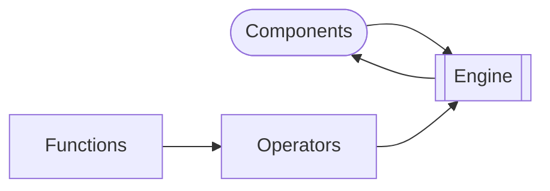

Galacticus evolves halos and galaxies using its "_evolver engine_", which works by applying various "_operators_" to the "_components_" which make up a halo/galaxy system. Here's a schematic - click (you may have to middle-click to make this work) on any item for more details.

Consider the following, highly simplified, description of how the process of star formation causes the mass of stars, $M_\star$, to increase with time, while simultaneously decreasing the mass of the ISM, $M_\mathrm{ISM}$:

$$
\frac{\color{magenta}\mathrm{d}\color{red}M_\star}{\color{magenta}\mathrm{d}t} = \color{magenta}+\color{blue}\frac{M_\mathrm{ISM}}{\tau_\star}
$$

$$
\frac{\color{magenta}\mathrm{d}\color{red}M_\mathrm{ISM}}{\color{magenta}\mathrm{d}t} = \color{magenta}-\color{blue}\frac{M_\mathrm{ISM}}{\tau_\star}
$$

# Components

The variables highlighted in red represent physical quantities - in this case the masses of stars and ISM in the galaxy. These are provided by a "[_component_](https://github.com/galacticusorg/galacticus/releases/download/bleeding-edge/Galacticus_Physics.pdf#sec.components)" (e.g. a galactic disk) in Galacticus.

# Operators

The operators highlighted in magenta represent a physical process - in this case the process of star formation, which moves mass from the ISM to the stars. Physical processes in Galacticus are implemented by the [`nodeOperatorClass`](https://github.com/galacticusorg/galacticus/releases/download/bleeding-edge/Galacticus_Physics.pdf#physics.nodeOperator).

# Functions

The function highlighted in blue represents the actual physics of that process - in this case it describes the rate of star formation. Such functions in Galacticus are provided by numerous different [`functionClass`](https://github.com/galacticusorg/galacticus/releases/download/bleeding-edge/Galacticus_Development.pdf#class.functionClass) objects - e.g. [`starFormationRateDisksClass`](https://github.com/galacticusorg/galacticus/releases/download/bleeding-edge/Galacticus_Physics.pdf#physics.starFormationRate) in the case of star formation rates in galaxy disks.

# Engine

Galacticus' evolver engine works by applying a set of  [`nodeOperatorClass`](https://github.com/galacticusorg/galacticus/releases/download/bleeding-edge/Galacticus_Physics.pdf#physics.nodeOperator) objects to each node in a merger tree in turn - gradually evolving the components in that node forward in time in accordance with the physical processes described by those  [`nodeOperatorClass`](https://github.com/galacticusorg/galacticus/releases/download/bleeding-edge/Galacticus_Physics.pdf#physics.nodeOperator) objects.
