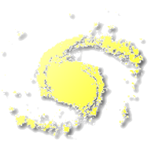

# Galacticus

Benchmark and validation metrics for the [Galacticus](https://github.com/galacticusorg/galacticus) galaxy formation model. Documentation lives on the [wiki](https://github.com/galacticusorg/galacticus/wiki).

See the [status dashboard](dashboard.html) for a one-page summary of every metric, or browse by group below.

## [Dark matter-only subhalos](groups/dmoSubhalos.html)

Generic dark matter-only subhalo benchmarks and validations.

1 metric(s).

## [Symphony CDM Milky Way](groups/symphonyCDM.html)

Dark matter-only subhalos calibrated against the Symphony Milky Way zoom-in suite.

_[Nadler et al. (2023)](https://ui.adsabs.harvard.edu/abs/2023ApJ...945..159N)_

3 metric(s).

## [COZMIC WDM Milky Way](groups/cozmicWDM.html)

Dark matter-only subhalos in warm dark matter cosmologies, calibrated against the COZMIC suite.

_[Nadler et al. (2025); An et al. (2025)](https://ui.adsabs.harvard.edu/abs/2025ApJ...986..127N)_

12 metric(s).

## [Decaying dark matter subhalos](groups/decayingDM.html)

Dark matter-only subhalos in two-body decaying dark matter cosmologies.

_[Nadler & Benson (2025)](https://ui.adsabs.harvard.edu/abs/2025arXiv250112636N)_

6 metric(s).

## [Idealized subhalo simulations](groups/idealizedSubhalos.html)

Idealized subhalo evolution under controlled tidal stripping.

_[Du et al. (2024)](https://ui.adsabs.harvard.edu/abs/2024arXiv240309597D)_

8 metric(s).

## [Milky Way model](groups/milkyWayModel.html)

Full Milky Way galaxy formation model.

1 metric(s).

## [Convergence tests](groups/convergence.html)

Numerical convergence checks of internal Galacticus algorithms.

2 metric(s).

## [Strong lensing](groups/strongLensing.html)

Subhalo populations relevant to strong gravitational lensing measurements.

1 metric(s).

## [Baryonic suppression](groups/baryonicSuppression.html)

Suppression of structure growth by baryonic physics.

1 metric(s).

## [Build metrics](groups/meta.html)

Compilation profiling and other build-time diagnostics.

1 metric(s).

